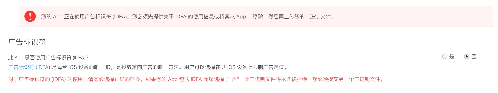
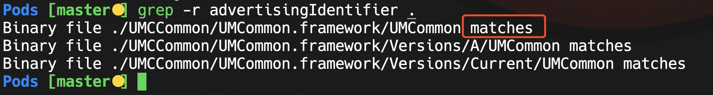

iOS上架AppStore时，如果项目中获取了IDFA标识符，不管最终有没有使用相关代码，在提审的时候，都得选择包含广告，否则会报错，具体内容如下。

# 一、检测iOS项目
## 不含广告
---
选择没有广告


---
但是项目里包含了IDFA相关的代码，则直接报错


<!--more-->


## 包含广告
如果项目本身没有使用过IDFA相关代码，但是三方库中引用了，比如已知的有友盟，则可以选择包含广告，选择下面2项即可通过审核。


## 检测项目包含IDFA
如何查看项目中包含IDFA相关代码，则可以使用以下命令。
循环遍历项目，是否包含`advertisingIdentifier`代码。
```bash
cd yourProjectFolder
grep -r advertisingIdentifier .
```

matches代表友盟SDK中包含了IDFA相关代码




# 二、grep使用
先附上一个Linux命令集合
[github](https://github.com/jaywcjlove/linux-command)
[linux命令搜索](https://wangchujiang.com/linux-command/)

> grep(global search regular expression and print out the line) 
> 全面搜索正则表达式并把行打印出来
> 主要用户搜索、过滤

## 服务器查找指定服务

```bash
# 查找tomcat服务
ps -ef | grep tomcat 
ps aux | grep web

# 杀掉服务
kill -9 端口号
```

## 常用选项
```bash
-r / -R  # 递归查询，包含子文件夹

-e       # 指定字符串查找
-E       # 使用正则表达式

-i       # 忽略大小写

-n       # 显示编号

-v       # 反转查找，就是除它之外的
```

## 使用例子

### 最基本查找
```bash
grep xxx file_name

例：
11833 _posts/Linux git:(master) ✗ » grep iOS Grep命令.md
iOS上架AppStore时，如果项目中获取了IDFA标识符，不管最终有没有使用相关代码，在提审的时候，都得选择包含广告，否则会报错，具体内容如下。
# 一、检测iOS项目
11834 _posts/Linux git:(master) ✗ »
```

### 参数用法
```bash
grep -r -i -v xxx file_name

grep -riv xxx file_name  # 参数可合并

grep -r xxx .  # 点代表当前路径下全部文件

例：
11840 _posts/Linux git:(master) ✗ » grep -r 服务 .
./Grep命令.md:## 服务器查找指定服务
./Grep命令.md:# 查找tomcat服务
./Grep命令.md:# 杀掉服务
./Linux-learning.md:# 服务管理
11841 _posts/Linux git:(master) ✗ »
```

### 表达式
```bash
grep -E "[1-9]+"
# 或
egrep "[1-9]+"

例：
11859 _posts/Linux git:(master) ✗ » grep -E "[1-5]+" Grep命令.md
date: 2020-01-01 12:39:54
如果项目本身没有使用过IDFA相关代码，但是三方库中引用了，比如已知的有友盟，则可以选择包含广告，选择下面2项即可通过审核。
11833 _posts/Linux git:(master) ✗ » grep iOS Grep命令.md
11834 _posts/Linux git:(master) ✗ »
11840 _posts/Linux git:(master) ✗ » grep -r 服务 .
11841 _posts/Linux git:(master) ✗ »
grep -E "[1-9]+"
egrep "[1-9]+"
11860 _posts/Linux git:(master) ✗ »
```

## 结束语
以上是目前比较常见的用法，以后遇到再补充。