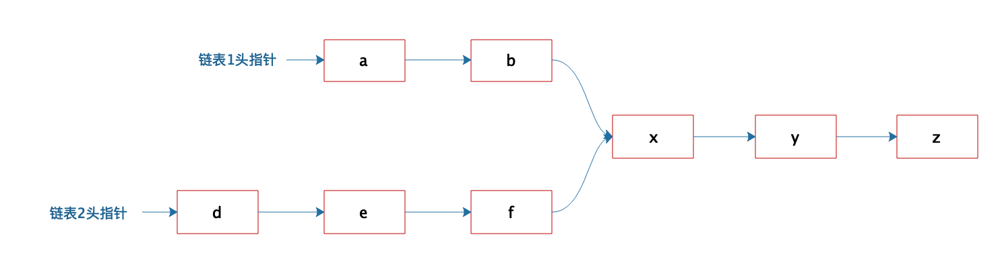
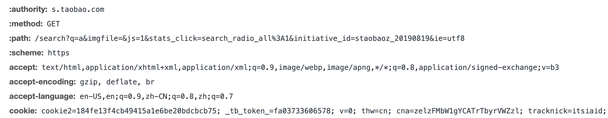
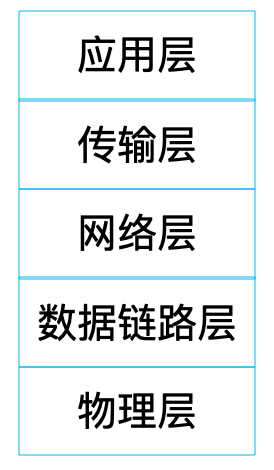

> 记录学习`后端技术38讲`专栏重要知识点。

# 一、程序如何运行和如何崩溃
## 1.如何运行 
>程序： 代码+算法
>进程： 运行起来的程序

    1.可执行代码
    2.堆内存控件
    3.栈内存控件
    4.进程数据结构

>在申请`堆空间`，会把内存首地址，记录到`栈`

## 同时运行多程序
 1.运行   数目小于CPU数目
 2.就绪   除CPU外，一切就绪
 3.阻塞   例如：等I/O,等待锁
 
### 线程
>为解决 `进程`在CPU上切换，代价大。使用更小的单位


<!--more-->


## 系统变慢、崩溃
>多任务处理

> 操作系统将硬件分时（CPU）分片（内存）管理，虚拟化成一个独享资源，让JVM进程在其上运行

```
物理服务器
    操作系统
        JVM进程
            Tomcat容器
                应用程序（war包）
                多线程1
                多线程2
                。。。
```                

### 系统变慢
每个`线程`有自己的`线程栈`，所以可以有相同变量。
但同时操作`内存堆`，称为：`临界区`。涉及到`线程安全`，解决办法：`加锁`
结果：会造成等待，系统变慢。

### 系统崩溃
被阻塞的线程，会占用资源。这些线程既不执行，也不释放。资源就会耗尽。
结果：系统`宕机` 

### 解决方案
1.分布式系统架构
2.请求入口`限流`
3.在应用内进行业务`降级`


# 二、数据结构原理
> Hash表的时间复杂度为什么是==O(1)==？

## 数组
连续空间、相同数据
通过下标+内存位置 = 元素位置  ==O(1)==
优点：查 时间复杂度==O(1)==
缺点: 改 ==O(N)==

## 链表
不连续空间
头指针 -> data/next  -> data/next -> null
优点: 改 ==O(1)==
缺点：查 ==O(N)==

## Hash表
Key/Value  
通过`Key`计算`HashCode`计算数组下标
==余数法== ：使用Hash表的数组长度对HashCode求余，余数即为数组下标。
```
例： key="abc" value="hello"  
1.计算key的HashCode 
    "abc".hashcode = 101
2.计算HashCode对应的hash表索引
    101 % 8 = 5 
3.则5就是下标
```
### hash冲突
> 解决方案是：`链表法`

### 真实情况
> Hash表中的数组，要求存储`固定`长度数据。所以里面存储的是Key/Value元素的地址==指针==
> 冲突的元素，直接加到链表就行了
> 最坏的情况，全都冲突，则复杂度==O(N)==

## 栈
对`数组`和`链表`加以限制，因为他们可以随意访问、修改
后进先出
有限制，安全简单。
简单：是开发应该追求的目标。

## 队列
受限的线性表
先进先出

## 树
线性表：每个元素只有一个`前驱`和一个`后继`
数是==非线性的==

## 思考题
> 如图：如何判断2个链表是否合并？如果合并，找到合并元素，即X元素。


```
答案：
计算2个链表的长度，谁长，谁先往前走。
待`长链表`未查看长度等于`短链表`时，
两两元素比较，
如果相等，则合并，此元素为X元素。
如果比较完，没有相等，则没有合并。
```

# 三、Java虚拟机原理
> java是一门跨平台语言。
> 可以运行在Windows、Linux等。
> 可在运行在X86、ARM架构的CPU上。

> 因为有JVM（Java Virtual Machine）

## JVM的组成构造


# 四、网络编程原理
Tomcat: web容器管理网络通信
Dubbo : 分布式服务框架完成网络通信

## DNS
> IP协议： InternetProtocol  
为方便编程，一般都用域名，DNS负责解析域名

## CDN
> 内容分发网络 Content Delivery Network
为提高访问速度,在运营商接入缓存服务器，缓存静态资源（图片、资源）

> 一般通过二级域名区分 例：image.taobao.com
 
## 应用层 HTTP
==应用层协议==  主要约定如何编码协议。

### 请求头 
HTTP请求头里包含了信息：GET/POST/DELETE/PUT/HEAD/TRACE等、缓存控制Cache-Control、响应过期时间Expires、Cookie等
Post方法的还包含body部分，会在请求头里Content-Length里声明body长度。



### 响应头
包含各种参数：状态码status、
==200：成功==

==3XX：请求被重定向==
302: 被临时重定向到新的URL

==4XX: 客户端错误==
403：请求为授权，被禁止访问
404：请求页面不存在

==5XX：服务器异常==
500：请求为完成
502：请求处理超时
503：服务器过载

### 响应体
body：
浏览器： HTML
App: JSON 

## 传输层 TCP
==传输层协议==  建立稳定通信连接。
为全球范围提供，所以统一应用层协议，使用==HTTP协议==
socket编程

## 网络层  IP协议
IP协议不可靠。所以需要TCP三次握手
头部添加IP地址

## 数据链路层
将数据封装：==数据帧== 以此为单位进行通信，此层定义帧的大小，称为==最大传输单元==
==帧头：== 发送者和接受者的mac地址,是网卡的设备标识符。唯一的

## 物理层
 处理不同设备、光纤、电缆等信号
 
## OSI七层网络协议
应用层：  应用层/表示层/会话层  
TCP/IP协议将OSI顶部三层合并为一个应用层。 
HTTP协议就是TCP/IP协议中的应用层协议。



## 总结
每一层都添加一个头，不超过链路层最大传输单元的前提。
每层协议在上一层基础上，添加一个头，最后封装成一个==数据帧==
收到请求后，进行校验检查，准确后，删除头部信息。交给上一层协议处理。

## LB（负责均衡）
==Load balancing==
解决高并发问题
DNS解析出来的是LB的IP地址
淘宝的解决方案：Linux内核的链路层负载均衡，也叫（直接路由模式）
例：LB拿到数据包后，直接修改数据帧的mac地址，然后将数据重新发送给服务器集群所在的局域网。
这个数据帧就会被真实的服务器收到。
LB和真实的配置相同IP地址。所以响应的就直接发给App了，不经过LB。


# 七、面向对象编程
